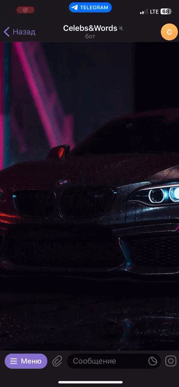

# Telegram Bot - registration and support

# Навигация

- [Навигация](#навигация)
- [Зачем нужен этот бот?](#зачем-нужен-этот-бот)
- [Установка](#установка)
     - [Установка необходимых Python-пакетов](#установка-необходимых-python-пакетов)
     - [Настройка перед запуском](#настройка-перед-запуском)
     - [Запуск бота](#запуск-бота)

# Зачем нужен этот бот?

Генерация слов для игры в "[Активити](https://www.mosigra.ru/activity/rules/)"; с готовой базой данных на 1500+ слов.

Генерация известных личностей для игры в "[Шляпу](https://www.mosigra.ru/shlyapa/rules/)" или "Угадай кто я?" с готовой базой данных на 500+ известных людей;

### Пользовательский интерфейс

# Установка

Для работы бота необходимо установить [Python версии 3.10 и выше](https://www.python.org/downloads/).

### Установка необходимых Python-пакетов

    python3 -m pip install -r requirements.txt

### Настройка перед запуском

Перед запуском бота требуется:

1) создать телеграм токен у [@BotFather](https://t.me/BotFather) командой <b>/newbot</b>;
2) вставить полученный токен в файл [.env](.env);
3) получить свой телеграм ID у бота [@getmyid_bot](https://t.me/getmyid_bot);
4) вставить полученный user ID в поле admins в файле [config.py](lib/config.py)

## Запуск бота

    python3 main.py
